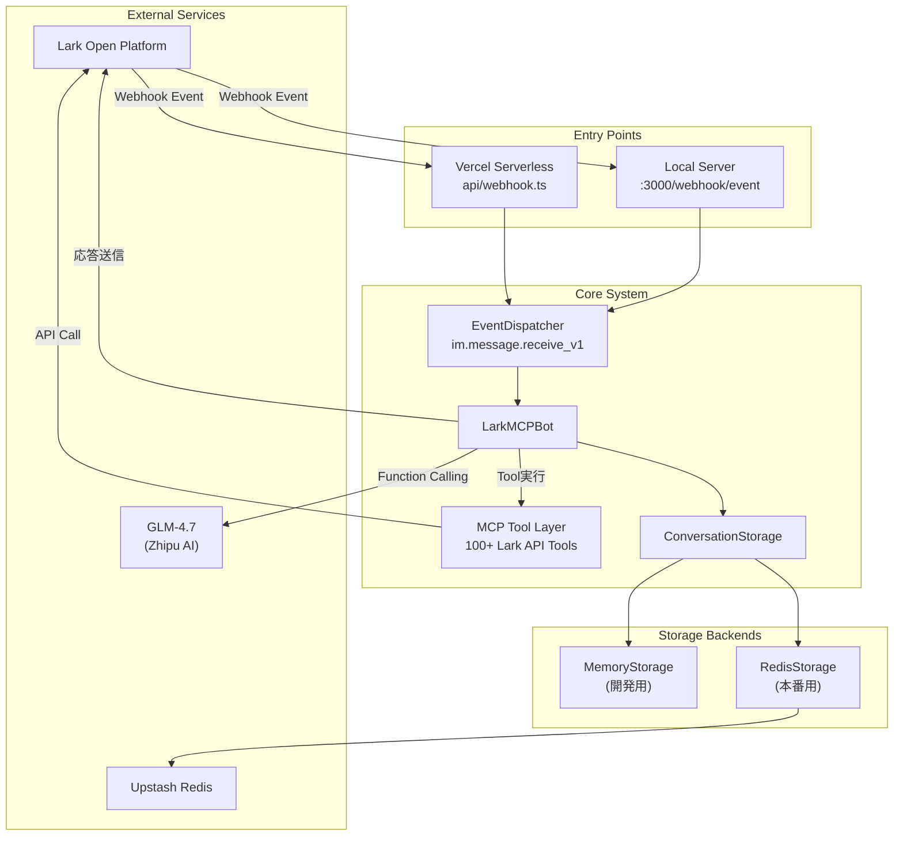
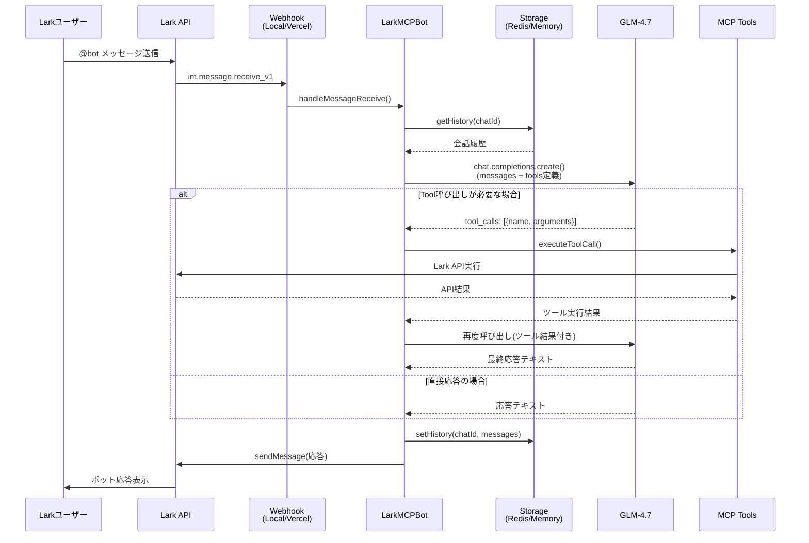
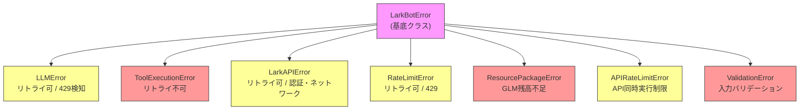
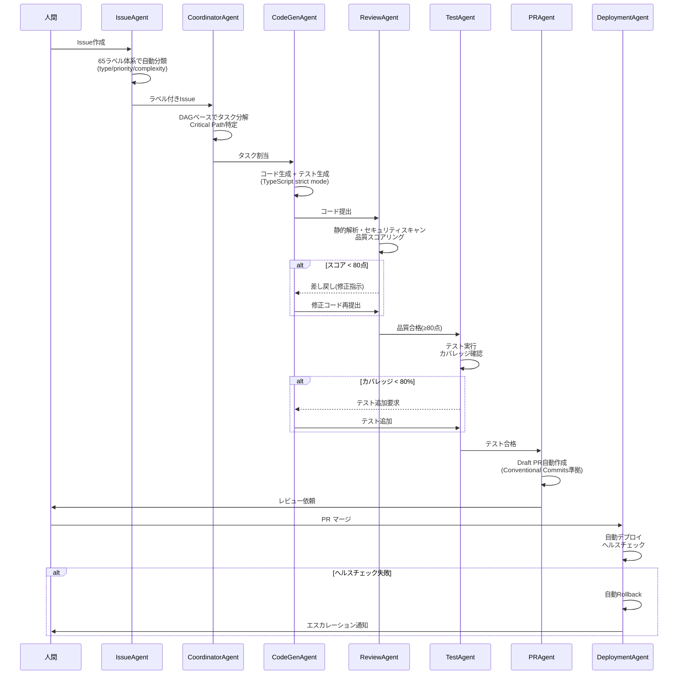

# Lark MCP AI Agent Bot

Lark（Feishu）のテナント内をMCP（Model Context Protocol）経由で自由自在に操るAIエージェントボットです。GLM-4.7をLLMとして使用します。

## 🎯 特徴

- **Lark API統合**: `@larksuiteoapi/node-sdk`を使用した完全なLark APIアクセス
- **MCPツール統合**: `@larksuiteoapi/lark-mcp`による100+のLark APIツールをGLM-4.7のFunction Callingに変換
- **GLM-4.7連携**: Zhipu AIのGLM-4.7モデルによる高精度な応答生成と自動的なツール選択
- **会話履歴管理**: チャットごとのコンテキスト保持（最大30メッセージ）
- **エラーハンドリング**: 自動リトライ・構造化ログ・適切なエラーメッセージ

## 📋 できること

| 機能 | 説明 |
|------|------|
| メッセージ送信 | チャットにテキストメッセージを送信 |
| メッセージ検索 | チャット内のメッセージを検索・要約 |
| チャット管理 | グループチャットの作成・情報取得 |
| ユーザー情報 | ユーザー情報の取得 |
| ドキュメント読み取り | Larkドキュメントの内容取得 |
| Bitable操作 | Baseのレコード検索・作成・更新 |

## 🏗️ アーキテクチャ

### 全体構成



### メッセージ処理シーケンス

ユーザーがLarkでボットにメンションしてから応答が返るまでの流れ:



### エラーハンドリング階層



### Miyabi Agent ワークフロー（自律開発パイプライン）

GitHub Issueの作成からデプロイまでの自律型開発フロー:



## 🚀 セットアップ

### 1. 依存関係のインストール

```bash
npm install
```

### 2. 環境変数の設定

`.env`ファイルを編集します：

```env
# Lark App Credentials
LARK_APP_ID=your_app_id_here
LARK_APP_SECRET=your_app_secret_here

# Lark API Domain
LARK_DOMAIN=https://open.feishu.cn

# GLM-4.7 API Key (Zhipu AI)
GLM_API_KEY=your_glm_api_key_here
GLM_API_BASE_URL=https://api.z.ai/api/paas/v4
GLM_MODEL=glm-4.7

# Server Configuration
PORT=3000
WEBHOOK_PATH=/webhook/event
```

### 3. Larkアプリの設定

1. [Lark Open Platform](https://open.feishu.cn/) でアプリを作成
2. `APP_ID` と `APP_SECRET` を取得
3. 必要な権限を付与：
   - `im:message` （メッセージ送信・受信）
   - `im:chat` （チャット情報取得）
   - `contact:user.base:readonly` （ユーザー情報取得）
   - `docx:document` （ドキュメント読み取り）
   - `bitable:app` （Base操作）

## 🏃 実行

### 開発モード

```bash
npm run dev
```

### ビルド

```bash
npm run build
```

### 本番実行

```bash
npm start
```

## 📁 プロジェクト構造

```
lark-mcp-bot/
├── src/
│   ├── bot/
│   │   └── index.ts       # メインボットロジック（MCP統合・Function Calling）
│   ├── config.ts          # 設定管理
│   ├── types.ts           # 型定義
│   └── index.ts           # HTTPサーバー・Webhookエンドポイント
├── tests/
│   ├── bot.test.ts        # ユニットテスト
│   ├── integration.test.ts # 統合テスト
│   └── setup.ts         # テスト共通設定
├── package.json
├── tsconfig.json
├── vitest.config.ts
└── .env               # 環境変数（.gitignore済み）
```

## 🔌 MCPツール

ボットは以下のMCPツールを提供します：

| ツール名 | 説明 |
|---------|------|
| `lark_send_message` | チャットにメッセージを送信 |
| `lark_list_messages` | チャットのメッセージ一覧を取得 |
| `lark_get_chat` | チャット情報を取得 |
| `lark_create_chat` | 新しいグループチャットを作成 |
| `lark_get_user` | ユーザー情報を取得 |
| `lark_get_document` | ドキュメントの内容を取得 |
| `lark_search_bitable` | Baseのレコードを検索 |
| `lark_create_bitable_record` | Baseにレコードを作成 |
| `lark_update_bitable_record` | Baseのレコードを更新 |

## 💬 使用例

### Larkチャットでボットに話しかける

Larkでボットにメンションして会話します。ボットはGLM-4.7であなたのリクエストを解析し、適切なLark APIを自動的に実行します。

```
ユーザー: @bot こんにちは！
ボット: こんにちは！私はLarkのAIアシスタントボットです。メッセージ検索、ドキュメント読み取り、Base操作などができます。

ユーザー: @bot 最近のメッセージを要約して
ボット: [最近のメッセージの要約を表示]

ユーザー: @bot 新しいグループを作成して
ボット: グループ名と参加メンバーを教えてください。

ユーザー: @bot チャット一覧見せて
ボット: [チャット一覧を表示]

ユーザー: @bot Bitableにレコード追加して
ボット: どのBaseのどのテーブルに追加しますか？
```

## 🧪 テスト

### ユニットテスト

個々のコンポーネントのテスト：

```bash
npm test
```

### 統合テスト

エンドツーエンドのメッセージフローのテスト：

```bash
npm test -- tests/integration.test.ts
```

### カバレッジ

カバレッジレポートを表示：

```bash
npm run test:coverage
```

目標: 80%以上のカバレッジ

## 🔧 トラブルシューティング

### GLM API残高不足

ボットが応答しない場合、GLM API残高が不足している可能性があります。以下の手順で確認してください：

1. [Zhipu AI Open Platform](https://open.bigmodel.cn/) にアクセス
2. API残高を確認
3. 必要に応じてチャージする

### GLM APIキーの取得

1. [Zhipu AI Open Platform](https://open.bigmodel.cn/) にアクセス
2. アカウントを作成・ログイン
3. API Keyを発行
4. `.env`ファイルに設定

### テストが失敗する場合

```bash
# モックをクリアして再実行
npm test -- --run

# デバッグモードで実行
npm test -- --reporter=verbose
```

## 📄 ライセンス

MIT License

## 🙏 参考リンク

- [Lark Open Platform](https://open.feishu.cn/)
- [Zhipu AI GLM-4.7](https://docs.z.ai/guides/llm/glm-4.7)
- [Model Context Protocol](https://modelcontextprotocol.io/)
