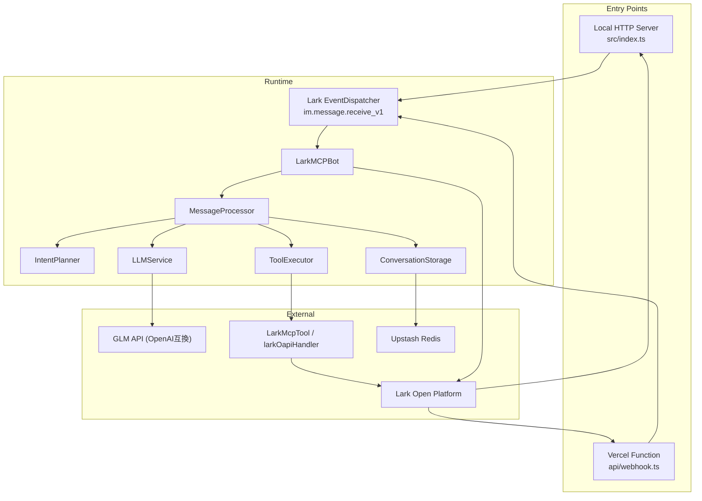
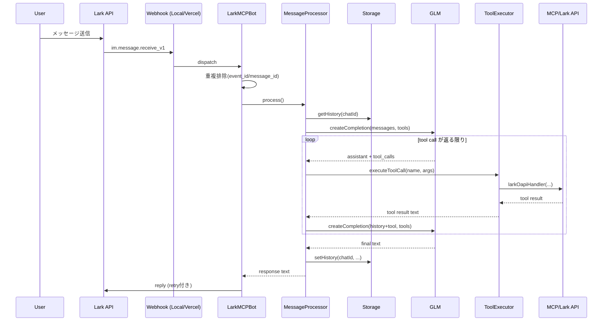

# Lark MCP AI Agent Bot

Lark（Feishu）のテナント内をMCP（Model Context Protocol）経由で自由自在に操るAIエージェントボットです。GLM-4.7をLLMとして使用します。

## 🎯 特徴

- **Lark API統合**: `@larksuiteoapi/node-sdk`を使用した完全なLark APIアクセス
- **MCPツール統合**: `@larksuiteoapi/lark-mcp`による100+のLark APIツールをGLM-4.7のFunction Callingに変換
- **MCPツールフィルタリング**: 必要なツールだけを有効化してパフォーマンス最適化
- **GLM-4.7連携**: Zhipu AIのGLM-4.7モデルによる高精度な応答生成と自動的なツール選択
- **会話履歴管理**: チャットごとのコンテキスト保持（最大30メッセージ）
- **強化されたエラーハンドリング**: カスタムエラークラス、自動リトライ、リトライ可否判定
- **構造化ロギング**: JSON形式のログ、ログレベル設定、パフォーマンスメトリクス計測

## 📋 できること

| 機能 | 説明 |
|------|------|
| メッセージ送信 | チャットにテキストメッセージを送信 |
| メッセージ検索 | チャット内のメッセージを検索・要約 |
| チャット管理 | グループチャットの作成・情報取得 |
| ユーザー情報 | ユーザー情報の取得 |
| ドキュメント読み取り | Larkドキュメントの内容取得 |
| Bitable操作 | Baseのレコード検索・作成・更新 |

## 🏗️ アーキテクチャ

現在の実装（`src/bot/index.ts`, `src/bot/message-processor.ts`, `src/bot/tool-executor.ts`, `api/webhook.ts`）に基づく構成です。

### 全体構成（実装準拠）


```mermaid
graph TB
    subgraph "Entry Points"
        Local["Local HTTP Server<br/>src/index.ts"]
        Vercel["Vercel Function<br/>api/webhook.ts"]
    end

    subgraph "Runtime"
        Dispatcher["Lark EventDispatcher<br/>im.message.receive_v1"]
        Bot["LarkMCPBot"]
        Processor["MessageProcessor"]
        Planner["IntentPlanner"]
        LLM["LLMService"]
        Exec["ToolExecutor"]
        Storage["ConversationStorage"]
    end

    subgraph "External"
        LarkAPI["Lark Open Platform"]
        GLM["GLM API (OpenAI互換)"]
        MCP["LarkMcpTool / larkOapiHandler"]
        Redis["Upstash Redis"]
    end

    LarkAPI --> Local
    LarkAPI --> Vercel
    Local --> Dispatcher
    Vercel --> Dispatcher
    Dispatcher --> Bot
    Bot --> Processor
    Processor --> Planner
    Processor --> LLM
    Processor --> Exec
    Exec --> MCP
    MCP --> LarkAPI
    Processor --> Storage
    Storage --> Redis
    LLM --> GLM
    Bot --> LarkAPI
```

### コンポーネント責務

- `LarkMCPBot`
  - イベント受信、重複排除、非同期処理制御、返信リトライを担当
  - Vercel実行時は webhook ライフサイクル内で処理完了まで `await`
- `MessageProcessor`
  - メンション判定、履歴読み書き、システムプロンプト生成、Function Calling ループを担当
  - ツール実行後の follow-up 呼び出しでも `tools` を再送して再帰的に tool call を処理
- `ToolExecutor`
  - MCPツールを Function 定義に変換し、呼び出し時にバリデーションと実行を実施
  - `calendar.v4.freebusy.list` など一部ツールの引数正規化を実装
- `ConversationStorage`
  - `UPSTASH_REDIS_*` が設定されていれば Redis、未設定なら Memory を利用

### メッセージ処理シーケンス


```mermaid
sequenceDiagram
    participant U as User
    participant L as Lark API
    participant W as Webhook (Local/Vercel)
    participant B as LarkMCPBot
    participant P as MessageProcessor
    participant S as Storage
    participant G as GLM
    participant T as ToolExecutor
    participant M as MCP/Lark API

    U->>L: メッセージ送信
    L->>W: im.message.receive_v1
    W->>B: dispatch
    B->>B: 重複排除(event_id/message_id)
    B->>P: process()
    P->>S: getHistory(chatId)
    P->>G: createCompletion(messages, tools)

    loop tool call が返る限り
        G-->>P: assistant + tool_calls
        P->>T: executeToolCall(name, args)
        T->>M: larkOapiHandler(...)
        M-->>T: tool result
        T-->>P: tool result text
        P->>G: createCompletion(history+tool, tools)
    end

    G-->>P: final text
    P->>S: setHistory(chatId, ...)
    P-->>B: response text
    B->>L: reply (retry付き)
```

### エラークラス

- `LarkBotError`（基底）
- `LLMError`
- `ToolExecutionError`
- `LarkAPIError`
- `ResourcePackageError`
- `APIRateLimitError`
- `ValidationError`
## 🚀 デプロイ

### 本番環境（Vercel + Upstash Redis）推奨 ⭐

対話型ボットとして本番運用する場合は、Vercelデプロイを推奨します：

📖 **詳細**: [Vercelデプロイガイド](./docs/VERCEL-DEPLOYMENT.md)

**実装済み機能**:
- ✅ **会話コンテキスト保持**: Upstash Redis統合
- ✅ **自動ストレージ切り替え**: ローカル=メモリ、本番=Redis
- ✅ **Vercel API Routes対応**: `api/webhook.ts`
- ✅ **300秒実行時間**: Vercel Proプラン対応

**メリット**:
- ✅ 固定URL（変更不要）
- ✅ 対話型ボット（前の会話を覚えている）
- ✅ 自動スケーリング
- ✅ CI/CD統合（GitHubプッシュで自動デプロイ）
- ✅ グローバルCDN

**5分でデプロイ**:
```bash
# 1. Vercel CLIでデプロイ
vercel --prod

# 2. 環境変数を設定（Vercel Dashboard）
UPSTASH_REDIS_REST_URL=https://...
UPSTASH_REDIS_REST_TOKEN=...
```


## 🚀 セットアップ

### 1. 依存関係のインストール

```bash
npm install
```

### 2. 環境変数の設定

`.env`ファイルを編集します：

```env
# Lark App Credentials
LARK_APP_ID=your_app_id_here
LARK_APP_SECRET=your_app_secret_here

# GLM-4.7 API Key (Zhipu AI)
GLM_API_KEY=your_glm_api_key_here
# Coding Plan endpoint:
# - Claude Code / Goose: https://api.z.ai/api/anthropic
# - Other tools: https://api.z.ai/api/coding/paas/v4
GLM_API_BASE_URL=https://api.z.ai/api/coding/paas/v4
GLM_MODEL=glm-4.7

# Server Configuration
PORT=3000
WEBHOOK_PATH=/webhook/event

# Logging Configuration (オプション)
LOG_LEVEL=info                          # debug/info/warn/error
ENABLE_PERFORMANCE_METRICS=true         # true/false

# MCP Tool Filtering (オプション)
DISABLED_TOOLS=                         # 明示的に無効化するツール（カンマ区切り）
```

### 3. Larkアプリの設定

1. [Lark Open Platform](https://open.larksuite.com/) でアプリを作成
2. `APP_ID` と `APP_SECRET` を取得
3. 必要な権限を付与：
   - `im:message` （メッセージ送信・受信）
   - `im:chat` （チャット情報取得）
   - `contact:user.base:readonly` （ユーザー情報取得）
   - `docx:document` （ドキュメント読み取り）
   - `bitable:app` （Base操作）

## 🏃 実行

### 開発モード

```bash
npm run dev
```

### ビルド

```bash
npm run build
```

### 本番実行

```bash
npm start
```

## 📁 プロジェクト構造

```
lark-mcp-bot/
├── src/
│   ├── bot/
│   │   └── index.ts       # メインボットロジック（MCP統合・Function Calling）
│   ├── config.ts          # 設定管理
│   ├── types.ts           # 型定義
│   └── index.ts           # HTTPサーバー・Webhookエンドポイント
├── tests/
│   ├── bot.test.ts        # ユニットテスト
│   ├── integration.test.ts # 統合テスト
│   └── setup.ts         # テスト共通設定
├── package.json
├── tsconfig.json
├── vitest.config.ts
└── .env               # 環境変数（.gitignore済み）
```

## 🔌 MCPツール

ボットは以下のMCPツールを提供します：

| ツール名 | 説明 |
|---------|------|
| `lark_send_message` | チャットにメッセージを送信 |
| `lark_list_messages` | チャットのメッセージ一覧を取得 |
| `lark_get_chat` | チャット情報を取得 |
| `lark_create_chat` | 新しいグループチャットを作成 |
| `lark_get_user` | ユーザー情報を取得 |
| `lark_get_document` | ドキュメントの内容を取得 |
| `lark_search_bitable` | Baseのレコードを検索 |
| `lark_create_bitable_record` | Baseにレコードを作成 |
| `lark_update_bitable_record` | Baseのレコードを更新 |

## 💬 使用例

### Larkチャットでボットに話しかける

Larkでボットにメンションして会話します。ボットはGLM-4.7であなたのリクエストを解析し、適切なLark APIを自動的に実行します。

```
ユーザー: @bot こんにちは！
ボット: こんにちは！私はLarkのAIアシスタントボットです。メッセージ検索、ドキュメント読み取り、Base操作などができます。

ユーザー: @bot 最近のメッセージを要約して
ボット: [最近のメッセージの要約を表示]

ユーザー: @bot 新しいグループを作成して
ボット: グループ名と参加メンバーを教えてください。

ユーザー: @bot チャット一覧見せて
ボット: [チャット一覧を表示]

ユーザー: @bot Bitableにレコード追加して
ボット: どのBaseのどのテーブルに追加しますか？
```

## 🧪 テスト

### ユニットテスト

個々のコンポーネントのテスト：

```bash
npm test
```

### 統合テスト

エンドツーエンドのメッセージフローのテスト：

```bash
npm test -- tests/integration.test.ts
```

### カバレッジ

カバレッジレポートを表示：

```bash
npm run test:coverage
```

目標: 80%以上のカバレッジ

## 🔧 トラブルシューティング

### GLM API残高不足

ボットが応答しない場合、GLM API残高が不足している可能性があります。以下の手順で確認してください：

1. [Zhipu AI Open Platform](https://open.bigmodel.cn/) にアクセス
2. API残高を確認
3. 必要に応じてチャージする

### GLM APIキーの取得

1. [Zhipu AI Open Platform](https://open.bigmodel.cn/) にアクセス
2. アカウントを作成・ログイン
3. API Keyを発行
4. `.env`ファイルに設定

### ログレベルの調整

デバッグ時により詳細なログを確認したい場合：

```env
LOG_LEVEL=debug
```

本番環境でログを削減したい場合：

```env
LOG_LEVEL=warn
```

### パフォーマンス問題

メッセージ応答が遅い場合、以下を確認：

1. **MCPツール無効化**: 不要なツールを明示的に無効化
   ```env
   DISABLED_TOOLS=drive.v1.permissionMember.create,contact.v3.user.batchGetId
   ```

2. **パフォーマンスメトリクス確認**: ログからボトルネックを特定
   ```env
   ENABLE_PERFORMANCE_METRICS=true
   LOG_LEVEL=info
   ```
   
   ログから`duration_ms`を確認して処理時間を分析

3. **会話履歴の削減**: 必要に応じてコード内の`MAX_CONVERSATIONS`や履歴保持数を調整

### テストが失敗する場合

```bash
# モックをクリアして再実行
npm test -- --run

# デバッグモードで実行
npm test -- --reporter=verbose
```

## 📄 ライセンス

MIT License

## 🙏 参考リンク

- [Lark Open Platform](https://open.larksuite.com/)
- [Zhipu AI GLM-4.7](https://docs.z.ai/guides/llm/glm-4.7)
- [Model Context Protocol](https://modelcontextprotocol.io/)
