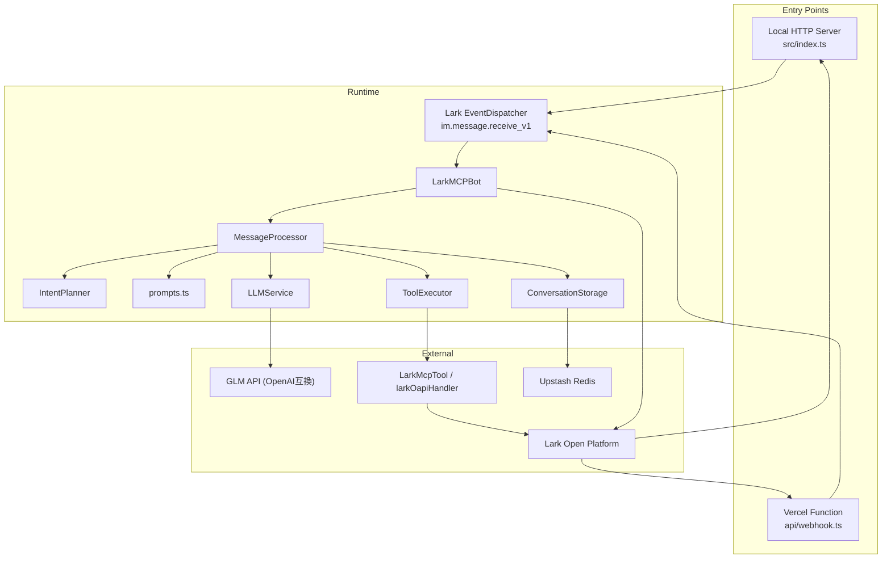
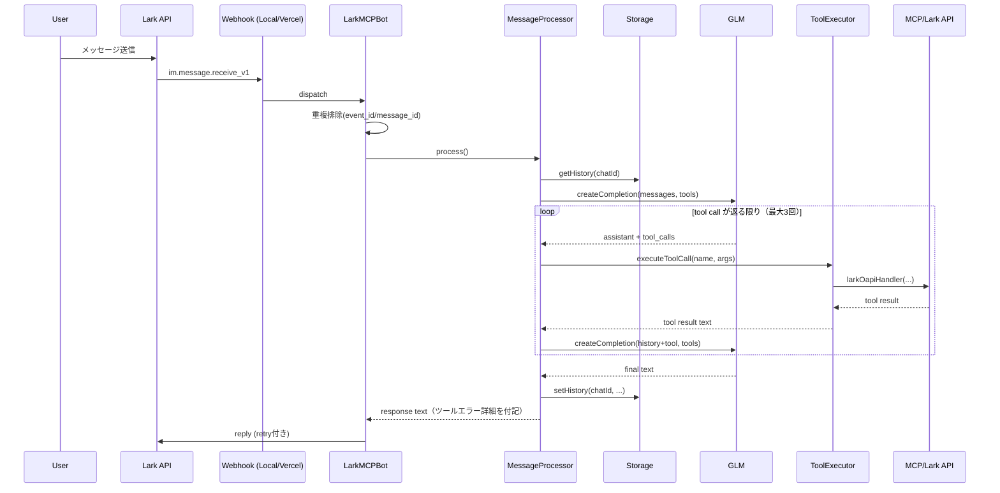

# Lark MCP AI Agent Bot

Lark（Feishu）のテナント内をMCP（Model Context Protocol）経由で自由自在に操るAIエージェントボットです。GLM-4.7をLLMとして使用します。

## 🎯 特徴

- **Lark API統合**: `@larksuiteoapi/node-sdk`を使用した完全なLark APIアクセス
- **MCPツール統合**: `@larksuiteoapi/lark-mcp`による27のLark APIツールをGLM-4.7のFunction Callingに変換
- **MCPツールフィルタリング**: 必要なツールだけを有効化してコンテキスト・パフォーマンス最適化
- **GLM-4.7連携**: Zhipu AIのGLM-4.7モデルによる高精度な応答生成と自動的なツール選択
- **会話履歴管理**: チャットごとのコンテキスト保持（最大30メッセージ）、長期会話は自動要約
- **強化されたエラーハンドリング**: カスタムエラークラス、APIレートリミット時の自動リトライ（指数バックオフ）、ツールエラー詳細をチャットに出力
- **構造化ロギング**: JSON形式のログ、ログレベル設定、パフォーマンスメトリクス計測
- **プロンプト管理**: `src/bot/prompts.ts` でプロンプト定数を一元管理、用途別に条件付き注入

## 📋 できること

| 機能 | 説明 |
|------|------|
| メッセージ送信 | チャットにテキストメッセージを送信 |
| メッセージ検索 | チャット内のメッセージ一覧を取得 |
| チャット管理 | グループチャットの作成・メンバー取得 |
| ユーザー情報 | ユーザー情報の取得 |
| ドキュメント操作 | Larkドキュメントの読み取り・検索・インポート |
| Wiki操作 | Wikiノードの検索・取得 |
| Bitable操作 | Base/テーブル/フィールド/レコードの作成・検索・更新 |
| カレンダー | イベントの作成・取得・編集、空き時間確認 |
| タスク | タスクの作成・更新・メンバー追加・リマインダー設定 |

## 🏗️ アーキテクチャ

現在の実装（`src/bot/index.ts`, `src/bot/message-processor.ts`, `src/bot/tool-executor.ts`, `api/webhook.ts`）に基づく構成です。

### 全体構成（実装準拠）


```mermaid
graph TB
    subgraph "Entry Points"
        Local["Local HTTP Server<br/>src/index.ts"]
        Vercel["Vercel Function<br/>api/webhook.ts"]
    end

    subgraph "Runtime"
        Dispatcher["Lark EventDispatcher<br/>im.message.receive_v1"]
        Bot["LarkMCPBot"]
        Processor["MessageProcessor"]
        Planner["IntentPlanner"]
        Prompts["prompts.ts"]
        LLM["LLMService"]
        Exec["ToolExecutor"]
        Storage["ConversationStorage"]
    end

    subgraph "External"
        LarkAPI["Lark Open Platform"]
        GLM["GLM API (OpenAI互換)"]
        MCP["LarkMcpTool / larkOapiHandler"]
        Redis["Upstash Redis"]
    end

    LarkAPI --> Local
    LarkAPI --> Vercel
    Local --> Dispatcher
    Vercel --> Dispatcher
    Dispatcher --> Bot
    Bot --> Processor
    Processor --> Planner
    Processor --> Prompts
    Processor --> LLM
    Processor --> Exec
    Exec --> MCP
    MCP --> LarkAPI
    Processor --> Storage
    Storage --> Redis
    LLM --> GLM
    Bot --> LarkAPI
```

### コンポーネント責務

- `LarkMCPBot`
  - イベント受信、重複排除、非同期処理制御、返信リトライを担当
  - Vercel実行時は50秒タイムアウト付きで処理完了まで `await`
- `MessageProcessor`
  - メンション判定、履歴読み書き、Function Calling ループを担当
  - ツール実行後の follow-up 呼び出しでも `tools` を再送して再帰的に tool call を処理
  - ツールエラー詳細を最終レスポンスに追記
- `prompts.ts`
  - システムプロンプト・要約プロンプト・エラーリプロンプトの定数を一元管理
  - ドメイン別ヒント（Bitable等）はユーザーメッセージの内容に応じて条件付き注入
- `LLMService`
  - GLM API呼び出し、APIレートリミット（1302/1303/1305）時の指数バックオフリトライ
  - タイムアウトは120秒（タイムアウトエラーはリトライしない）
- `ToolExecutor`
  - MCPツールを Function 定義に変換し、呼び出し時にバリデーションと実行を実施
  - Bitableツールの path パラメータ正規化（`app_token`/`table_id` 等を `path` サブオブジェクトへ）
  - フィールドの JSON 文字列自動パース、`data.table` への統合
- `ConversationStorage`
  - `KV_REST_API_URL` / `KV_REST_API_READ_ONLY_TOKEN` が設定されていれば Redis、未設定なら Memory を利用

### メッセージ処理シーケンス


```mermaid
sequenceDiagram
    participant U as User
    participant L as Lark API
    participant W as Webhook (Local/Vercel)
    participant B as LarkMCPBot
    participant P as MessageProcessor
    participant S as Storage
    participant G as GLM
    participant T as ToolExecutor
    participant M as MCP/Lark API

    U->>L: メッセージ送信
    L->>W: im.message.receive_v1
    W->>B: dispatch
    B->>B: 重複排除(event_id/message_id)
    B->>P: process()
    P->>S: getHistory(chatId)
    P->>G: createCompletion(messages, tools)

    loop tool call が返る限り（最大3回）
        G-->>P: assistant + tool_calls
        P->>T: executeToolCall(name, args)
        T->>M: larkOapiHandler(...)
        M-->>T: tool result
        T-->>P: tool result text
        P->>G: createCompletion(history+tool, tools)
    end

    G-->>P: final text
    P->>S: setHistory(chatId, ...)
    P-->>B: response text（ツールエラー詳細を付記）
    B->>L: reply (retry付き)
```

### 有効なMCPツール（27個）

| カテゴリ | ツール |
|---------|--------|
| メッセージ | `im.v1.message.create`, `im.v1.message.list` |
| チャット | `im.v1.chat.create`, `im.v1.chat.list`, `im.v1.chatMembers.get` |
| Bitable | `bitable.v1.app.create`, `bitable.v1.appTable.create`, `bitable.v1.appTable.list`, `bitable.v1.appTableField.create`, `bitable.v1.appTableField.list`, `bitable.v1.appTableRecord.create`, `bitable.v1.appTableRecord.search`, `bitable.v1.appTableRecord.update` |
| ドキュメント | `docx.v1.document.rawContent`, `docx.builtin.import`, `docx.builtin.search` |
| Wiki | `wiki.v2.space.getNode`, `wiki.v1.node.search` |
| ドライブ | `drive.v1.permissionMember.create` |
| ユーザー | `contact.v3.user.batchGetId` |
| カレンダー | `calendar.v4.calendarEvent.create`, `calendar.v4.calendarEvent.patch`, `calendar.v4.calendarEvent.get`, `calendar.v4.freebusy.list`, `calendar.v4.calendar.primary` |
| タスク | `task.v2.task.create`, `task.v2.task.patch`, `task.v2.task.addMembers`, `task.v2.task.addReminders` |

### エラークラス

- `LarkBotError`（基底）
- `LLMError`
- `ToolExecutionError`
- `LarkAPIError`
- `ResourcePackageError`
- `APIRateLimitError`
- `ValidationError`

## 🚀 デプロイ

### 本番環境（Vercel + Upstash Redis）推奨 ⭐

対話型ボットとして本番運用する場合は、Vercelデプロイを推奨します：

📖 **詳細**: [Vercelデプロイガイド](./docs/VERCEL-DEPLOYMENT.md)

**実装済み機能**:
- ✅ **会話コンテキスト保持**: Upstash Redis統合
- ✅ **自動ストレージ切り替え**: ローカル=メモリ、本番=Redis
- ✅ **Vercel API Routes対応**: `api/webhook.ts`
- ✅ **300秒実行時間**: Vercel Proプラン対応（Fluid Compute有効時は最大800秒）

**メリット**:
- ✅ 固定URL（変更不要）
- ✅ 対話型ボット（前の会話を覚えている）
- ✅ 自動スケーリング
- ✅ CI/CD統合（GitHubプッシュで自動デプロイ）
- ✅ グローバルCDN

**5分でデプロイ**:
```bash
# 1. Vercel CLIでデプロイ
vercel --prod

# 2. 環境変数を設定（Vercel Dashboard）
KV_REST_API_URL=https://...
KV_REST_API_READ_ONLY_TOKEN=...
```


## 🚀 セットアップ

### 1. 依存関係のインストール

```bash
npm install
```

### 2. 環境変数の設定

`.env`ファイルを編集します：

```env
# Lark App Credentials
LARK_APP_ID=your_app_id_here
LARK_APP_SECRET=your_app_secret_here

# GLM-4.7 API Key (Zhipu AI)
GLM_API_KEY=your_glm_api_key_here
# Coding Plan endpoint:
# - Claude Code / Goose: https://api.z.ai/api/anthropic
# - Other tools: https://api.z.ai/api/coding/paas/v4
GLM_API_BASE_URL=https://api.z.ai/api/coding/paas/v4
GLM_MODEL=glm-4.7

# Server Configuration
PORT=3000
WEBHOOK_PATH=/webhook/event

# OAuth Configuration (Required for document/wiki search, calendar, and tasks)
LARK_OAUTH_REDIRECT_URI=http://localhost:3000/auth/callback
# For production (Vercel):
# LARK_OAUTH_REDIRECT_URI=https://your-app.vercel.app/auth/callback

# Logging Configuration (オプション)
LOG_LEVEL=info                          # debug/info/warn/error
ENABLE_PERFORMANCE_METRICS=true         # true/false

# MCP Tool Filtering (オプション)
DISABLED_TOOLS=                         # 明示的に無効化するツール（カンマ区切り）
```

### 3. Larkアプリの設定

1. [Lark Open Platform](https://open.larksuite.com/) でアプリを作成
2. `APP_ID` と `APP_SECRET` を取得
3. 必要な権限を付与：
   - `im:message` （メッセージ送信・受信）
   - `im:chat` （チャット情報取得）
   - `contact:user.base:readonly` （ユーザー情報取得）
   - `docx:document` （ドキュメント読み取り）
   - `bitable:app` （Base操作）
   - `calendar:calendar` （カレンダー操作）
   - `task:task` （タスク操作）
4. **OAuth設定**（ドキュメント検索・Wiki検索・カレンダー・タスクに必須）：
   - アプリ設定で「OAuth」を有効化
   - リダイレクトURIを設定：
     - 開発環境: `http://localhost:3000/auth/callback`
     - 本番環境（Vercel）: `https://your-app.vercel.app/auth/callback`
   - スコープを追加：
     - `drive:drive:readonly` （ドキュメント・Wiki検索に必要）
     - `drive:drive:write` （ドキュメントインポートに必要）
     - `wiki:wiki:readonly` （Wiki検索に必要）
     - `calendar:calendar` （カレンダー操作）
     - `task:task:read`, `task:task:write` （タスク操作）
     - `offline_access` （トークン自動更新）

## 🏃 実行

### 開発モード

```bash
npm run dev
```

### ビルド

```bash
npm run build
```

### 本番実行

```bash
npm start
```

## 📁 プロジェクト構造

```
lark-mcp-bot/
├── src/
│   ├── bot/
│   │   ├── index.ts            # メインボットロジック（イベント処理・リトライ）
│   │   ├── message-processor.ts # メッセージ処理・Function Callingループ
│   │   ├── tool-executor.ts    # MCPツール実行・パラメータ正規化
│   │   ├── llm-service.ts      # GLM API呼び出し・リトライ制御
│   │   ├── intent-planner.ts   # インテント解析・スロット抽出
│   │   └── prompts.ts          # プロンプト定数の一元管理
│   ├── storage/                # 会話履歴ストレージ（Redis/Memory）
│   ├── utils/                  # ロガー等ユーティリティ
│   ├── config.ts               # 設定管理
│   ├── types.ts                # 型定義
│   └── index.ts                # HTTPサーバー・Webhookエンドポイント
├── api/
│   └── webhook.ts              # Vercel Serverless Function エントリポイント
├── tests/
│   ├── bot.test.ts             # ユニットテスト
│   ├── integration.test.ts     # 統合テスト
│   ├── tool-executor.test.ts   # ToolExecutorテスト
│   └── setup.ts                # テスト共通設定
├── vercel.json                 # Vercel設定（maxDuration: 300s）
├── package.json
├── tsconfig.json
└── vitest.config.ts
```

## 💬 使用例

### Larkチャットでボットに話しかける

Larkでボットにメンションして会話します。ボットはGLM-4.7であなたのリクエストを解析し、適切なLark APIを自動的に実行します。

```
ユーザー: @bot こんにちは！
ボット: こんにちは！私はLarkのAIアシスタントボットです。メッセージ検索、ドキュメント読み取り、Base操作などができます。

ユーザー: @bot 最近のメッセージを要約して
ボット: [最近のメッセージの要約を表示]

ユーザー: @bot 自動車整備工場用のBaseを作成して
ボット: Baseを作成しました。続いてテーブルとフィールドを追加します...

ユーザー: @bot 来週の空き時間を教えて
ボット: [カレンダーの空き時間を表示]
```

## 🧪 テスト

```bash
# 全テスト実行
npm test

# 統合テストのみ
npm test -- tests/integration.test.ts

# カバレッジレポート（目標: 80%以上）
npm run test:coverage
```

## 🔧 トラブルシューティング

### GLM APIがタイムアウトする

GLM APIの応答が120秒を超えると失敗します。以下を確認してください：

1. ツール数を絞る（`DISABLED_TOOLS` で不要なツールを無効化）
2. 会話履歴が長い場合は新しいチャットで試す
3. リクエストを短く・具体的にする

### GLM API レートリミット（1302エラー）

同時リクエスト数制限に達しています。ボットは自動でリトライ（最大3回、指数バックオフ）しますが、頻発する場合はAPIプランを確認してください。

### Bitableツールエラー

エラー詳細はチャットのレスポンスに `ツールエラー詳細:` として表示されます。よくあるエラー：
- `field validation failed`: フィールドのtype値が不正（`src/bot/prompts.ts` の `BITABLE_HINTS` を参照）
- `request miss app_token path argument`: app_tokenが未指定

### OAuth認証エラー

ドキュメント検索・Wiki検索・カレンダー・タスク操作でエラーが発生する場合：

- **エラー 99991663 (権限不足)**: OAuthが設定されていません。以下の手順で設定してください：
  1. `.env` に `LARK_OAUTH_REDIRECT_URI` を設定
  2. Lark Open PlatformでOAuthを有効化し、リダイレクトURIとスコープを設定
  3. Larkチャットでボットに再度メンションして、認証リンクをクリック

- **エラー 99991679 (スコープ不足)**: OAuthスコープが不足しています。以下のスコープを確認してください：
  - ドキュメント検索: `drive:drive:readonly`
  - ドキュメント内容取得: `drive:drive:readonly`
  - ドキュメントインポート: `drive:drive:write`
  - Wiki検索: `wiki:wiki:readonly`
  - ドライブ権限追加: `drive:drive:write`
  - カレンダー操作: `calendar:calendar`, `calendar:calendar:readonly`, `calendar:calendar:update`, `calendar:calendar:create`
  - タスク操作: `task:task:read`, `task:task:write`, `task:tasklist:read`, `task:tasklist:write`

### ログレベルの調整

```env
LOG_LEVEL=debug   # デバッグ時
LOG_LEVEL=warn    # 本番でログ削減
```

### パフォーマンス問題

```env
ENABLE_PERFORMANCE_METRICS=true
LOG_LEVEL=info
```

ログの `duration_ms` でボトルネックを特定できます。

## 📄 ライセンス

MIT License

## 🙏 参考リンク

- [Lark Open Platform](https://open.larksuite.com/)
- [Zhipu AI GLM-4.7](https://docs.z.ai/guides/llm/glm-4.7)
- [Model Context Protocol](https://modelcontextprotocol.io/)
- [Bitable Field Guide](https://open.larksuite.com/document/uAjLw4CM/ukTMukTMukTM/reference/bitable-v1/app-table-field/guide)
