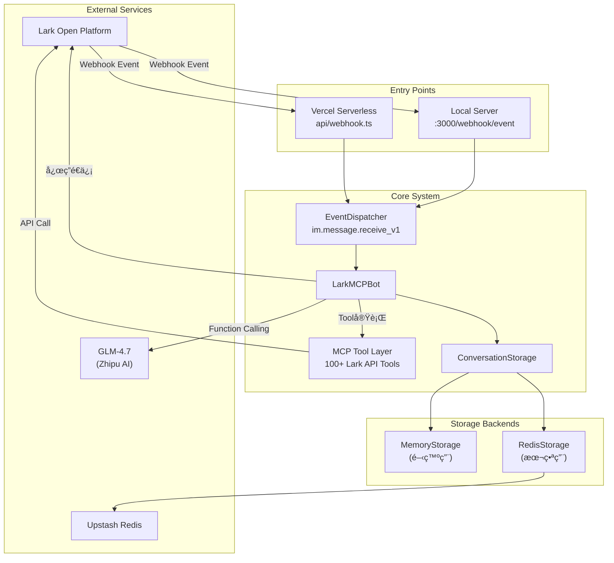
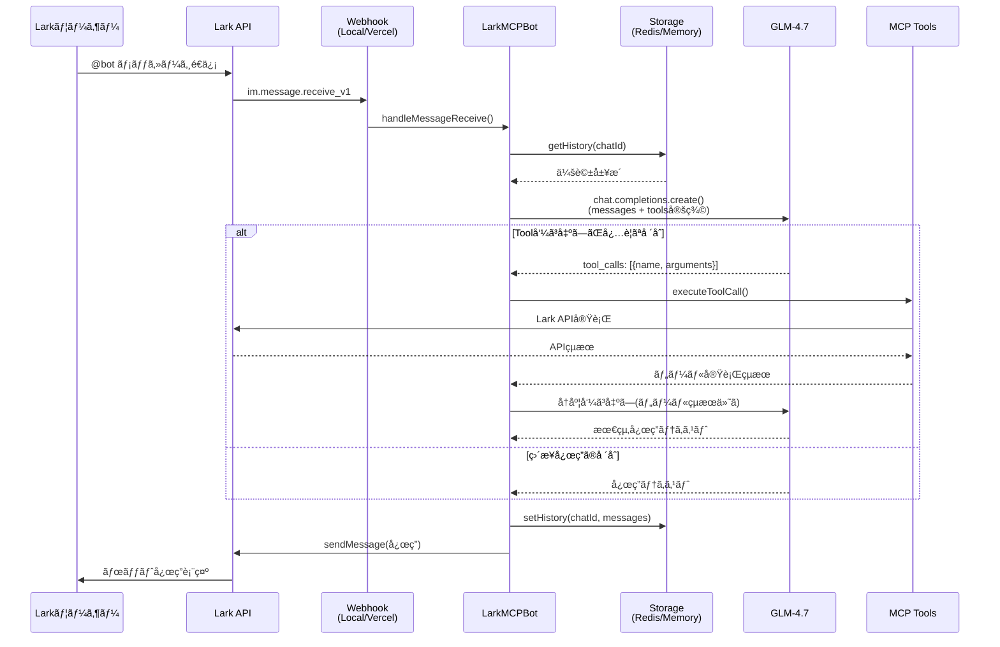
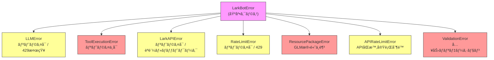
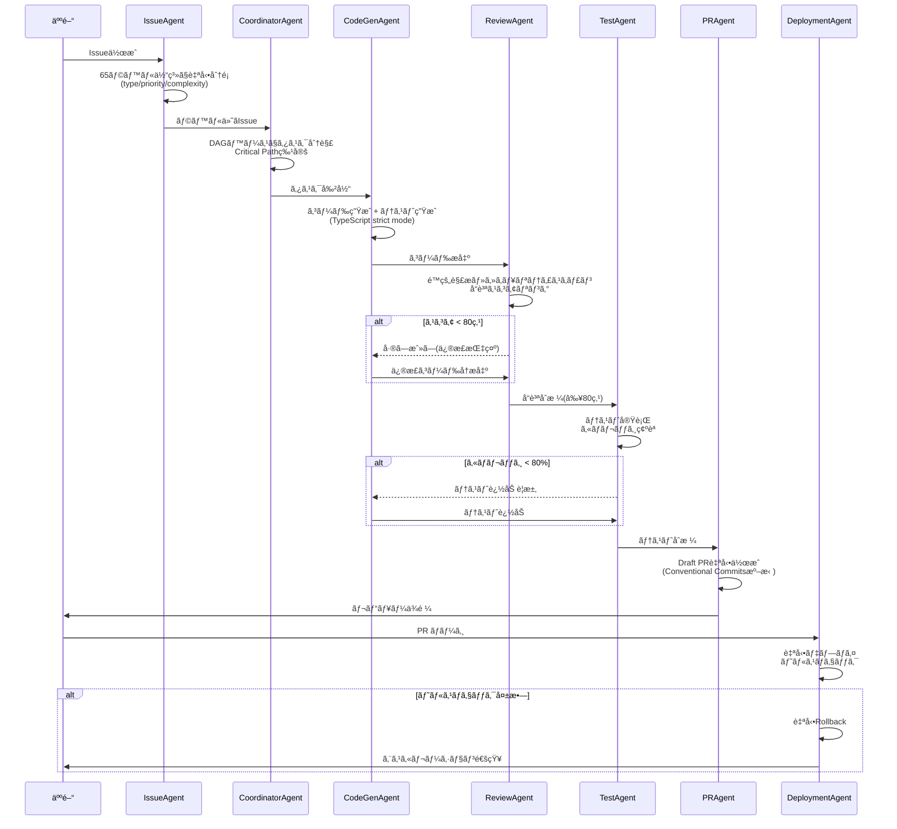

# Lark MCP AI Agent Bot

Lark（Feishu）ã®ãƒ†ãƒŠãƒ³ãƒˆå†…ã‚’MCP（Model Context Protocol）経由ã§è‡ªç”±è‡ªåœ¨ã«æ“ã‚‹AIエージェントボットã§ã™ã€‚GLM-4.7ã‚’LLMã¨ã—ã¦ä½¿ç”¨ã—ã¾ã™ã€‚

## 🯠特徴

- **Lark APIçµ±åˆ**: `@larksuiteoapi/node-sdk`を使用ã—ãŸå®Œå…¨ãªLark APIアクセス
- **MCPツール統åˆ**: `@larksuiteoapi/lark-mcp`ã«ã‚ˆã‚‹100+ã®Lark APIツールをGLM-4.7ã®Function Callingã«å¤‰æ›
- **GLM-4.7連æº**: Zhipu AIã®GLM-4.7モデルã«ã‚ˆã‚‹é«˜ç²¾åº¦ãªå¿œç­”生æˆã¨è‡ªå‹•çš„ãªãƒ„ールé¸æŠ
- **会話履歴管ç†**: ãƒãƒ£ãƒƒãƒˆã”ã¨ã®ã‚³ãƒ³ãƒ†ã‚­ã‚¹ãƒˆä¿æŒï¼ˆæœ€å¤§30メッセージ）
- **エラーãƒãƒ³ãƒ‰ãƒªãƒ³ã‚°**: 自動リトライ・構造化ログ・é©åˆ‡ãªã‚¨ãƒ©ãƒ¼ãƒ¡ãƒƒã‚»ãƒ¼ã‚¸

## 📋 ã§ãã‚‹ã“ã¨

| 機能 | èª¬æ˜ |
|------|------|
| メッセージé€ä¿¡ | ãƒãƒ£ãƒƒãƒˆã«ãƒ†ã‚­ã‚¹ãƒˆãƒ¡ãƒƒã‚»ãƒ¼ã‚¸ã‚’é€ä¿¡ |
| メッセージ検索 | ãƒãƒ£ãƒƒãƒˆå†…ã®ãƒ¡ãƒƒã‚»ãƒ¼ã‚¸ã‚’検索・è¦ç´„ |
| ãƒãƒ£ãƒƒãƒˆç®¡ç† | グループãƒãƒ£ãƒƒãƒˆã®ä½œæˆãƒ»æƒ…å ±å–å¾— |
| ユーザー情報 | ユーザー情報ã®å–å¾— |
| ドキュメント読ã¿å–ã‚Š | Larkドキュメントã®å†…容å–å¾— |
| Bitableæ“作 | Baseã®ãƒ¬ã‚³ãƒ¼ãƒ‰æ¤œç´¢ãƒ»ä½œæˆãƒ»æ›´æ–° |

## ğŸ—ï¸ ã‚¢ãƒ¼ã‚­ãƒ†ã‚¯ãƒãƒ£

### 全体構æˆ


```mermaid
graph TB
    subgraph "External Services"
        LarkAPI["Lark Open Platform"]
        GLM["GLM-4.7<br/>(Zhipu AI)"]
        Redis["Upstash Redis"]
    end

    subgraph "Entry Points"
        Local["Local Server<br/>:3000/webhook/event"]
        Vercel["Vercel Serverless<br/>api/webhook.ts"]
    end

    subgraph "Core System"
        ED["EventDispatcher<br/>im.message.receive_v1"]
        Bot["LarkMCPBot"]
        MCP["MCP Tool Layer<br/>100+ Lark API Tools"]
        Storage["ConversationStorage"]
    end

    subgraph "Storage Backends"
        Mem["MemoryStorage<br/>(開発用)"]
        RedisStore["RedisStorage<br/>(本番用)"]
    end

    LarkAPI -- "Webhook Event" --> Local
    LarkAPI -- "Webhook Event" --> Vercel
    Local --> ED
    Vercel --> ED
    ED --> Bot
    Bot -- "Function Calling" --> GLM
    Bot -- "Tool実行" --> MCP
    MCP -- "API Call" --> LarkAPI
    Bot --> Storage
    Storage --> Mem
    Storage --> RedisStore
    RedisStore --> Redis
    Bot -- "応答é€ä¿¡" --> LarkAPI
```

### メッセージ処ç†ã‚·ãƒ¼ã‚±ãƒ³ã‚¹

ユーザーãŒLarkã§ãƒœãƒƒãƒˆã«ãƒ¡ãƒ³ã‚·ãƒ§ãƒ³ã—ã¦ã‹ã‚‰å¿œç­”ãŒè¿”ã‚‹ã¾ã§ã®æµã‚Œ:


```mermaid
sequenceDiagram
    participant U as Larkユーザー
    participant L as Lark API
    participant W as Webhook<br/>(Local/Vercel)
    participant B as LarkMCPBot
    participant S as Storage<br/>(Redis/Memory)
    participant G as GLM-4.7
    participant M as MCP Tools

    U->>L: @bot メッセージé€ä¿¡
    L->>W: im.message.receive_v1
    W->>B: handleMessageReceive()

    B->>S: getHistory(chatId)
    S-->>B: 会話履歴

    B->>G: chat.completions.create()<br/>(messages + tools定義)

    alt Tool呼ã³å‡ºã—ãŒå¿…è¦ãªå ´åˆ
        G-->>B: tool_calls: [{name, arguments}]
        B->>M: executeToolCall()
        M->>L: Lark API実行
        L-->>M: APIçµæœ
        M-->>B: ツール実行çµæœ
        B->>G: å†åº¦å‘¼ã³å‡ºã—(ツールçµæœä»˜ã)
        G-->>B: 最終応答テキスト
    else ç›´æ¥å¿œç­”ã®å ´åˆ
        G-->>B: 応答テキスト
    end

    B->>S: setHistory(chatId, messages)
    B->>L: sendMessage(応答)
    L->>U: ボット応答表示
```

### エラーãƒãƒ³ãƒ‰ãƒªãƒ³ã‚°éšå±¤


```mermaid
graph TD
    Base["LarkBotError<br/>(基底クラス)"]
    Base --> LLM["LLMError<br/>ãƒªãƒˆãƒ©ã‚¤å¯ / 429検知"]
    Base --> Tool["ToolExecutionError<br/>リトライä¸å¯"]
    Base --> API["LarkAPIError<br/>ãƒªãƒˆãƒ©ã‚¤å¯ / èªè¨¼ãƒ»ãƒãƒƒãƒˆãƒ¯ãƒ¼ã‚¯"]
    Base --> Rate["RateLimitError<br/>ãƒªãƒˆãƒ©ã‚¤å¯ / 429"]
    Base --> Res["ResourcePackageError<br/>GLM残高ä¸è¶³"]
    Base --> APIRate["APIRateLimitError<br/>APIåŒæ™‚実行制é™"]
    Base --> Val["ValidationError<br/>入力ãƒãƒªãƒ‡ãƒ¼ã‚·ãƒ§ãƒ³"]

    style Base fill:#f9f,stroke:#333
    style LLM fill:#ff9,stroke:#333
    style Rate fill:#ff9,stroke:#333
    style API fill:#ff9,stroke:#333
    style Tool fill:#f99,stroke:#333
    style Res fill:#f99,stroke:#333
    style Val fill:#f99,stroke:#333
    style APIRate fill:#ff9,stroke:#333
```

### Miyabi Agent ワークフロー（自律開発パイプライン）

GitHub Issueã®ä½œæˆã‹ã‚‰ãƒ‡ãƒ—ロイã¾ã§ã®è‡ªå¾‹å‹é–‹ç™ºãƒ•ãƒ­ãƒ¼:


```mermaid
sequenceDiagram
    participant H as 人間
    participant I as IssueAgent
    participant C as CoordinatorAgent
    participant CG as CodeGenAgent
    participant R as ReviewAgent
    participant T as TestAgent
    participant PR as PRAgent
    participant D as DeploymentAgent

    H->>I: Issue作æˆ
    I->>I: 65ラベル体系ã§è‡ªå‹•åˆ†é¡<br/>(type/priority/complexity)
    I->>C: ラベル付ãIssue

    C->>C: DAGベースã§ã‚¿ã‚¹ã‚¯åˆ†è§£<br/>Critical Path特定
    C->>CG: タスク割当

    CG->>CG: ã‚³ãƒ¼ãƒ‰ç”Ÿæˆ + テスト生æˆ<br/>(TypeScript strict mode)
    CG->>R: コードæ出

    R->>R: é™çš„解æ・セキュリティスキャン<br/>å“質スコアリング

    alt スコア < 80点
        R-->>CG: å·®ã—戻ã—(修正指示)
        CG->>R: 修正コードå†æ出
    end

    R->>T: å“質åˆæ ¼(≥80点)
    T->>T: テスト実行<br/>ã‚«ãƒãƒ¬ãƒƒã‚¸ç¢ºèª

    alt ã‚«ãƒãƒ¬ãƒƒã‚¸ < 80%
        T-->>CG: テスト追加è¦æ±‚
        CG->>T: テスト追加
    end

    T->>PR: テストåˆæ ¼
    PR->>PR: Draft PR自動作æˆ<br/>(Conventional Commits準拠)
    PR->>H: レビューä¾é ¼

    H->>D: PR ãƒãƒ¼ã‚¸
    D->>D: 自動デプロイ<br/>ヘルスãƒã‚§ãƒƒã‚¯

    alt ヘルスãƒã‚§ãƒƒã‚¯å¤±æ•—
        D->>D: 自動Rollback
        D->>H: エスカレーション通知
    end
```

## 🚀 セットアップ

### 1. ä¾å­˜é–¢ä¿‚ã®ã‚¤ãƒ³ã‚¹ãƒˆãƒ¼ãƒ«

```bash
npm install
```

### 2. 環境変数ã®è¨­å®š

`.env`ファイルを編集ã—ã¾ã™ï¼š

```env
# Lark App Credentials
LARK_APP_ID=your_app_id_here
LARK_APP_SECRET=your_app_secret_here

# Lark API Domain
LARK_DOMAIN=https://open.feishu.cn

# GLM-4.7 API Key (Zhipu AI)
GLM_API_KEY=your_glm_api_key_here
GLM_API_BASE_URL=https://open.bigmodel.cn/api/paas/v4
GLM_MODEL=glm-4.7

# Server Configuration
PORT=3000
WEBHOOK_PATH=/webhook/event
```

### 3. Larkアプリã®è¨­å®š

1. [Lark Open Platform](https://open.feishu.cn/) ã§ã‚¢ãƒ—リを作æˆ
2. `APP_ID` 㨠`APP_SECRET` ã‚’å–å¾—
3. å¿…è¦ãªæ¨©é™ã‚’付ä¸ï¼š
   - `im:message` （メッセージé€ä¿¡ãƒ»å—信）
   - `im:chat` （ãƒãƒ£ãƒƒãƒˆæƒ…å ±å–得）
   - `contact:user.base:readonly` （ユーザー情報å–得）
   - `docx:document` （ドキュメント読ã¿å–り）
   - `bitable:app` （Baseæ“作）

## 🃠実行

### 開発モード

```bash
npm run dev
```

### ビルド

```bash
npm run build
```

### 本番実行

```bash
npm start
```

## 📠プロジェクト構造

```
lark-mcp-bot/
├── src/
│   ├── bot/
│   │   └── index.ts       # メインボットロジック（MCPçµ±åˆãƒ»Function Calling）
│   ├── config.ts          # 設定管ç†
│   ├── types.ts           # å‹å®šç¾©
│   └── index.ts           # HTTPサーãƒãƒ¼ãƒ»Webhookエンドãƒã‚¤ãƒ³ãƒˆ
├── tests/
│   ├── bot.test.ts        # ユニットテスト
│   ├── integration.test.ts # çµ±åˆãƒ†ã‚¹ãƒˆ
│   └── setup.ts         # テスト共通設定
├── package.json
├── tsconfig.json
├── vitest.config.ts
└── .env               # 環境変数（.gitignore済ã¿ï¼‰
```

## 🔌 MCPツール

ボットã¯ä»¥ä¸‹ã®MCPツールをæä¾›ã—ã¾ã™ï¼š

| ツールå | èª¬æ˜ |
|---------|------|
| `lark_send_message` | ãƒãƒ£ãƒƒãƒˆã«ãƒ¡ãƒƒã‚»ãƒ¼ã‚¸ã‚’é€ä¿¡ |
| `lark_list_messages` | ãƒãƒ£ãƒƒãƒˆã®ãƒ¡ãƒƒã‚»ãƒ¼ã‚¸ä¸€è¦§ã‚’å–å¾— |
| `lark_get_chat` | ãƒãƒ£ãƒƒãƒˆæƒ…報をå–å¾— |
| `lark_create_chat` | æ–°ã—ã„グループãƒãƒ£ãƒƒãƒˆã‚’ä½œæˆ |
| `lark_get_user` | ユーザー情報をå–å¾— |
| `lark_get_document` | ドキュメントã®å†…容をå–å¾— |
| `lark_search_bitable` | Baseã®ãƒ¬ã‚³ãƒ¼ãƒ‰ã‚’検索 |
| `lark_create_bitable_record` | Baseã«ãƒ¬ã‚³ãƒ¼ãƒ‰ã‚’ä½œæˆ |
| `lark_update_bitable_record` | Baseã®ãƒ¬ã‚³ãƒ¼ãƒ‰ã‚’æ›´æ–° |

## 💬 使用例

### Larkãƒãƒ£ãƒƒãƒˆã§ãƒœãƒƒãƒˆã«è©±ã—ã‹ã‘ã‚‹

Larkã§ãƒœãƒƒãƒˆã«ãƒ¡ãƒ³ã‚·ãƒ§ãƒ³ã—ã¦ä¼šè©±ã—ã¾ã™ã€‚ボットã¯GLM-4.7ã§ã‚ãªãŸã®ãƒªã‚¯ã‚¨ã‚¹ãƒˆã‚’解æã—ã€é©åˆ‡ãªLark APIを自動的ã«å®Ÿè¡Œã—ã¾ã™ã€‚

```
ユーザー: @bot ã“ã‚“ã«ã¡ã¯ï¼
ボット: ã“ã‚“ã«ã¡ã¯ï¼ç§ã¯Larkã®AIアシスタントボットã§ã™ã€‚メッセージ検索ã€ãƒ‰ã‚­ãƒ¥ãƒ¡ãƒ³ãƒˆèª­ã¿å–ã‚Šã€Baseæ“作ãªã©ãŒã§ãã¾ã™ã€‚

ユーザー: @bot 最近ã®ãƒ¡ãƒƒã‚»ãƒ¼ã‚¸ã‚’è¦ç´„ã—ã¦
ボット: [最近ã®ãƒ¡ãƒƒã‚»ãƒ¼ã‚¸ã®è¦ç´„を表示]

ユーザー: @bot æ–°ã—ã„グループを作æˆã—ã¦
ボット: グループåã¨å‚加メンãƒãƒ¼ã‚’æ•™ãˆã¦ãã ã•ã„。

ユーザー: @bot ãƒãƒ£ãƒƒãƒˆä¸€è¦§è¦‹ã›ã¦
ボット: [ãƒãƒ£ãƒƒãƒˆä¸€è¦§ã‚’表示]

ユーザー: @bot Bitableã«ãƒ¬ã‚³ãƒ¼ãƒ‰è¿½åŠ ã—ã¦
ボット: ã©ã®Baseã®ã©ã®ãƒ†ãƒ¼ãƒ–ルã«è¿½åŠ ã—ã¾ã™ã‹ï¼Ÿ
```

## 🧪 テスト

### ユニットテスト

個々ã®ã‚³ãƒ³ãƒãƒ¼ãƒãƒ³ãƒˆã®ãƒ†ã‚¹ãƒˆï¼š

```bash
npm test
```

### çµ±åˆãƒ†ã‚¹ãƒˆ

エンドツーエンドã®ãƒ¡ãƒƒã‚»ãƒ¼ã‚¸ãƒ•ãƒ­ãƒ¼ã®ãƒ†ã‚¹ãƒˆï¼š

```bash
npm test -- tests/integration.test.ts
```

### ã‚«ãƒãƒ¬ãƒƒã‚¸

ã‚«ãƒãƒ¬ãƒƒã‚¸ãƒ¬ãƒãƒ¼ãƒˆã‚’表示：

```bash
npm run test:coverage
```

目標: 80%以上ã®ã‚«ãƒãƒ¬ãƒƒã‚¸

## 🔧 トラブルシューティング

### GLM API残高ä¸è¶³

ボットãŒå¿œç­”ã—ãªã„å ´åˆã€GLM API残高ãŒä¸è¶³ã—ã¦ã„ã‚‹å¯èƒ½æ€§ãŒã‚ã‚Šã¾ã™ã€‚以下ã®æ‰‹é †ã§ç¢ºèªã—ã¦ãã ã•ã„：

1. [Zhipu AI Open Platform](https://open.bigmodel.cn/) ã«ã‚¢ã‚¯ã‚»ã‚¹
2. API残高を確èª
3. å¿…è¦ã«å¿œã˜ã¦ãƒãƒ£ãƒ¼ã‚¸ã™ã‚‹

### GLM APIキーã®å–å¾—

1. [Zhipu AI Open Platform](https://open.bigmodel.cn/) ã«ã‚¢ã‚¯ã‚»ã‚¹
2. アカウントを作æˆãƒ»ãƒ­ã‚°ã‚¤ãƒ³
3. API Keyを発行
4. `.env`ファイルã«è¨­å®š

### テストãŒå¤±æ•—ã™ã‚‹å ´åˆ

```bash
# モックをクリアã—ã¦å†å®Ÿè¡Œ
npm test -- --run

# デãƒãƒƒã‚°ãƒ¢ãƒ¼ãƒ‰ã§å®Ÿè¡Œ
npm test -- --reporter=verbose
```

## 📄 ライセンス

MIT License

## 🙠å‚考リンク

- [Lark Open Platform](https://open.feishu.cn/)
- [Zhipu AI GLM-4.7](https://docs.bigmodel.cn/cn/guide/start/model-overview)
- [Model Context Protocol](https://modelcontextprotocol.io/)
